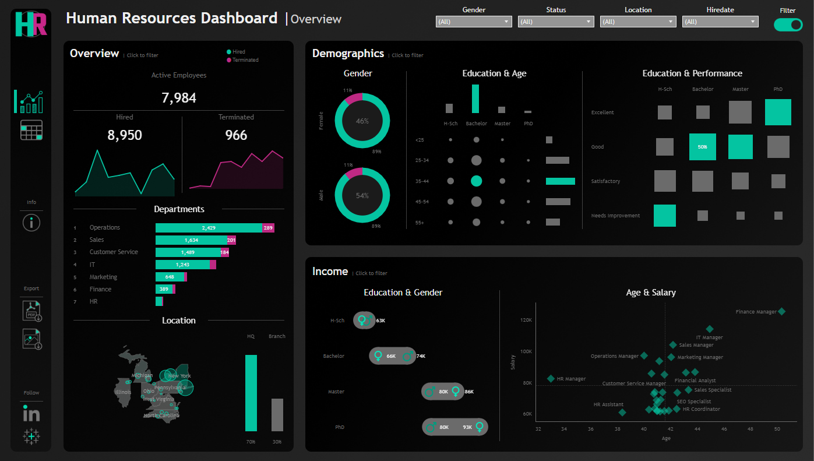
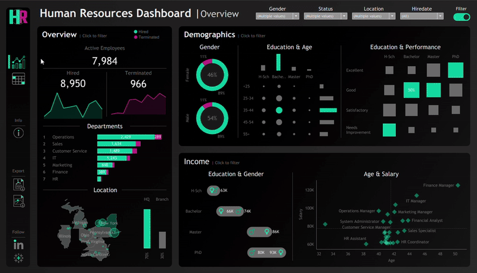

# Human Resources Dashboard

## Table of Contents
- [Introduction](#introduction)  
- [Datasets](#datasets)  
- [Dashboard File](#dashboard-file)  
- [Assets](#assets)  
- [Skills Demonstrated](#skills-demonstrated)  
- [Human Resources Dashboards](#human-resources-dashboards)  
  - [Overview](#overview)  
  - [Details](#details)  
- [Conclusion](#conclusion)  

## Introduction


This project delivers a Human Resources Dashboard built in Tableau.  
It provides interactive visualizations to explore workforce data, demographics, salary structures, and performance metrics.  

The dashboard is structured into two views—**Overview** and **Details**—providing both a high-level summary of workforce trends and the ability to drill down into individual-level insights.

## Datasets
The raw HR dataset used for the analysis can be found here: [dataset.csv](dataset.csv)  

## Dashboard File
This project is available both as a packaged Tableau workbook and as a published interactive version:  
- The Tableau packaged workbook containing the full dashboard and dataset: [HR_Dashboard.twbx](HR_Dashboard.twbx)  
- The interactive version hosted on Tableau Public for direct online exploration: [Interactive Tableau Version](https://public.tableau.com/app/profile/zoran.gusic/viz/HR_Dashboard_17583742122640/HRDetails)  

## Assets
- The folder containing icons and other visual assets is located here: [Icons](images/Icons)  
- The initial design sketch created in **draw.io** is available here: [Diagram_drawing.drawio](images/Diagram_drawing.drawio)  
- The background layout was designed in **Figma**, with gradients and lighting effects applied to improve depth and readability. Figma assets are stored here: [figma_images](images/figma_images)  

## Skills Demonstrated
- Applied data preparation and cleaning techniques for accuracy and consistency  
- Designed interactive dashboards in Tableau with user-friendly navigation  
- Built calculated fields and applied dynamic filtering for deeper analysis, for example:  
  - **Total Active**
    ```tableau
    COUNT( IF ISNULL([Termdate]) THEN [Employee ID] END )
    ```
  - **Total Hired**
    ```tableau
    COUNT([Employee ID])
    ```
  - **Total Terminated**
    ```tableau
    COUNT( IF NOT ISNULL([Termdate]) THEN [Employee ID] END )
    ```  
- Applied visualization best practices to highlight key patterns and trends  
- Structured dashboards to tell a data-driven story, combining design principles with HR insights for clear communication  

## Human Resources Dashboards  

### Overview  
  

**Highlights & Insights**  
- Includes a left-hand navigation panel for switching dashboards, accessing info, and exporting data  
- Provides a top filter bar for refining results by gender, status, location, and hire date  
- Displays an overview panel tracking total hires, terminations, and active employees over time  
- Breaks down departmental staffing levels with side-by-side counts of active and terminated employees  
- Maps workforce distribution across geographic locations  
- Presents demographic insights, including gender balance, education by age group, and performance ratings by education level  
- Features income analysis by education and gender, alongside a detailed salary–age scatter plot highlighting roles and pay distribution  

### Details  
  

**Highlights & Insights**  
- Builds on the same left-hand navigation, with additional links for exporting and external resources  
- Offers interactive filters through dropdowns and sliders to narrow results by demographics, role, geography, salary, status, and length of employment  
- Displays an employee list with sortable columns such as demographics, role, location, salary, status, and length of employment  
- Shows employee-level details including education, department, city/state, and compensation  
- Tracks employment information such as hire date, current status, and length of employment for stability analysis  

## Conclusion
This project demonstrates the ability to transform Human Resources data into actionable insights using Tableau.  
It showcases expertise in **data preparation**, **interactive dashboard design**, and **effective visualization**, delivering a tool that supports HR analysis and data-driven decision-making.  
